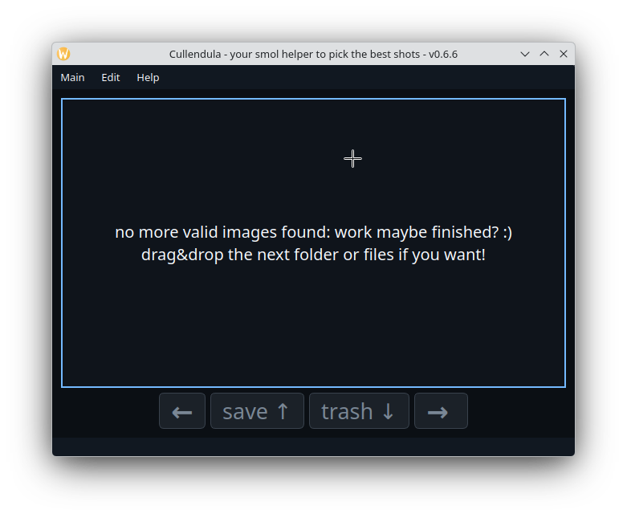
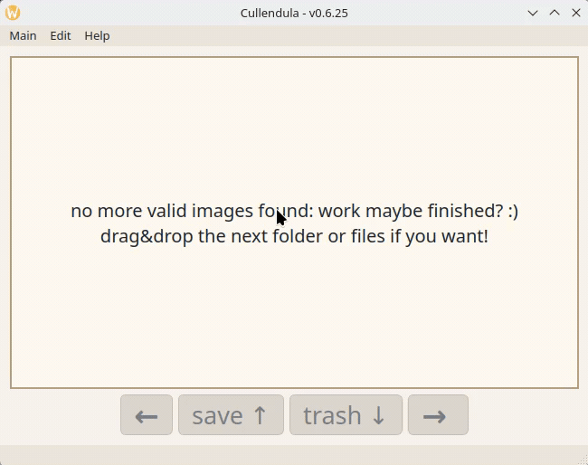
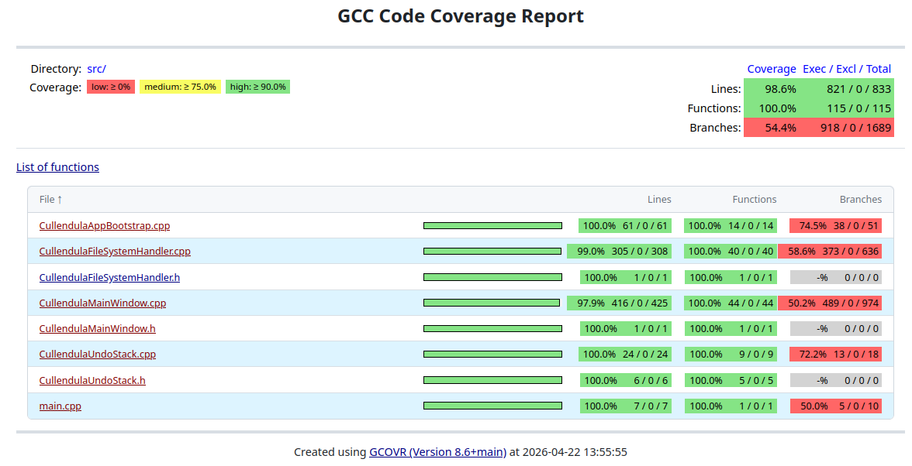

# Cullendula
A program to pick out the best shots of the vast amount of taken pictures per photo session.  
The name itself is a wordplay of the plant `Calendula` and the activity `to cull` (slang for filtering photos).

## How to use?
Start it and then drag&drop a folder with the pictures or an example picture to the central area of the app. Cullendula figures out itself which path to use.  
It also creates automatically a new folder named "output" inside the given path.  
The first picture of the files is loaded automatically too.  
Cullendula scans the dropped directory for the image file extensions currently enabled in `Main -> Extensions`. The menu offers up to ten common Qt-supported formats such as `jpg`, `jpeg`, `png`, and `webp`, and all entries are enabled by default.  
The widget-based UI also provides `Main -> Style` with `Light` and `Dark` themes. Light mode is the default, and dark mode uses a strong high-contrast palette. The theme is applied application-wide so Qt dialogs follow the selected mode as well.  
Switch between the images via the buttons at the bottom of the app or use the arrow-keys (**LEFT** and **RIGHT**).  
The button "save" (or **UP** arrow-key) moves the current image to the output-folder.  
The button "trash" (or **DOWN** arrow-key) moves the current image to the trash-folder.  
Undo and redo keep the in-memory image list and the visible main view synchronized with the on-disk file moves.  
When you are done, then close the app. The result (the best photos) are inside the output-folder :)  



### Preview of the language- and style-switching


## Build

### tl;dr
Use the `localPipeline.sh` to handle all steps for building, test-runs, documentation, coverage generation, and a final interactive launch of the built `Cullendula` app.

```sh
time ./localPipeline.sh
[INFO] Project root: /home/mpetrick/repos/Cullendula
[INFO] Build directory: /home/mpetrick/repos/Cullendula/build
[INFO] Coverage build directory: /home/mpetrick/repos/Cullendula/build-coverage
[INFO] Parallel jobs: 20
[INFO] Configuring project in '/home/mpetrick/repos/Cullendula/build'.
[INFO] Building project with 20 parallel job(s).
[INFO] Running unit tests via CTest with 20 parallel job(s).
[INFO] Configuring dedicated coverage build in '/home/mpetrick/repos/Cullendula/build-coverage'.
[INFO] Building coverage configuration with 20 parallel job(s).
[INFO] Generating coverage report.
[INFO] Coverage HTML entry point: /home/mpetrick/repos/Cullendula/build-coverage/coverage/html/index.html
[INFO] Total line coverage: 94.4%
[INFO] Opening coverage report with 'xdg-open'.
[INFO] Generating Doxygen documentation.
[INFO] Doxygen warnings file is empty.
[INFO] Doxygen HTML entry point: /home/mpetrick/repos/Cullendula/build/doxygen/html/index.html
[INFO] Opening generated documentation with 'xdg-open'.
[INFO] Running clang-format on project C++ sources.
[INFO] clang-format left all tracked source files unchanged.
[INFO] Launching Cullendula as the final pipeline step.
[INFO] Close the application window to let the script finish.

========== Local Pipeline Summary ==========
Configure+Build    : PASS Project configured and built in /home/mpetrick/repos/Cullendula/build
Unit Tests         : PASS CTest completed without failures
Coverage           : PASS Coverage HTML generated successfully in /home/mpetrick/repos/Cullendula/build-coverage
Coverage Gate      : PASS Line coverage is 94.4% (threshold 90.0%)
Open Coverage      : PASS Coverage index.html was handed to the desktop opener
Doxygen            : PASS Documentation generated successfully
Doxygen Warnings   : PASS warnings.txt is empty
Open Docs          : PASS index.html was handed to the desktop opener
clang-format       : PASS Formatting completed without changing files
Launch App         : PASS Cullendula was started; the script resumed after the window was closed
============================================
./localPipeline.sh  2.05s user 0.67s system 47% cpu 5.718 total
```

----

By default, the documented build commands use all available CPU cores via `--parallel $(nproc)`.
If you want the same behavior without repeating the flag, export `CMAKE_BUILD_PARALLEL_LEVEL=$(nproc)` in your shell first.

```
cmake -S . -B build
cmake --build build --parallel $(nproc)
./build/src/Cullendula
```

## Format the code
This repository ships a `.clang-format` using the default Google C++ style.

Run it from the repository root like this:

```bash
clang-format -i src/*.cpp src/*.h tests/*.cpp tests/*.h
```

## Generate API docs
If `doxygen` is installed when CMake configures the project, a `doxygen` target is available.

Generate the HTML documentation like this:

```bash
cmake -S . -B build
cmake --build build --target doxygen --parallel $(nproc)
```

The generated HTML entry point is:

* `build/doxygen/html/index.html`
* `build/doxygen/warnings.txt`

The configured Doxygen project version follows the current CMake project version automatically.

## Run the tests after building

The unit tests cover the core CLI and GUI behavior from the command line. They verify:

* `CullendulaUndoStack` push/undo/redo semantics
* `CullendulaFileSystemHandler` path parsing, navigation, file moves, and undo/redo integration
* `CullendulaMainWindow` drag and drop, button flows, menu actions, and basic widget state

You can run them in three supported CLI ways:

```
cmake --build build --target test --parallel $(nproc)

cmake --build build --target check --parallel $(nproc)

./build/tests/CullendulaTests
```

At the moment the test suite contains one test executable registered with CTest:

* `CullendulaUndoStackTest`

## Compute coverage

Coverage is opt-in and uses `gcov`. The default build is unchanged.

Build, run the tests, and generate the text coverage report:

```
cmake -S . -B build-coverage -DCULLENDULA_ENABLE_COVERAGE=ON
cmake --build build-coverage --parallel $(nproc)
cmake --build build-coverage --target coverage --parallel $(nproc)
```

This produces:

* `build-coverage/coverage/coverage.txt` as a text summary
* `build-coverage/coverage/gcov/*.gcov` as the detailed per-file gcov output

Because `gcov` also reports inlined code from headers, the coverage output includes relevant Qt and standard-library headers alongside the project source file.

The current coverage target reports on the production code exercised by the existing unit tests. Right now that includes:

* `src/CullendulaUndoStack.cpp`
* `src/CullendulaFileSystemHandler.cpp`
* `src/CullendulaMainWindow.cpp`

## HTML coverage

HTML coverage is only available if one of these standard tools is installed before configuring CMake:

* `gcovr`
* `lcov` together with `genhtml`

Install the tool first, then reconfigure and run:

```
cmake -S . -B build-coverage -DCULLENDULA_ENABLE_COVERAGE=ON
cmake --build build-coverage --target coverage-html --parallel $(nproc)
```

If the tool is missing, CMake disables the `coverage-html` target and prints a status message during configure.

This writes:

* `build-coverage/coverage/html/index.html`

### Current state of the coverage report:


## Localization
The repository now contains Qt Linguist translation source files in `translations/` for:

* German: `translations/Cullendula_de.ts`
* Croatian: `translations/Cullendula_hr.ts`
* Chinese: `translations/Cullendula_zh_CN.ts`

The CMake build uses Qt 6 `LinguistTools` to turn these `.ts` files into `.qm` files and embeds the generated `.qm` resources into the application. English remains the default language because the source strings are written in English. The runtime language switch is wired through `QTranslator`; the actual translation content can be filled in later without changing the surrounding application structure.

### Translation workflow
User-visible strings from Qt Designer `.ui` files are discovered automatically by Qt `lupdate`.
User-visible strings from C++ sources are discovered when they are marked with Qt translation APIs such as `tr(...)` or a class translation context like `Q_DECLARE_TR_FUNCTIONS(...)`.
Qt also supports translator-facing context:

* in C++ via translator comments written as `//:` immediately before a `tr(...)` call
* in Qt Designer `.ui` files via the `<string comment="...">...</string>` attribute
* for true same-text ambiguities in the same translation context via the optional disambiguation/comment parameter of `tr("Text", "meaning")`

Regenerate the translation source files after adding or changing source strings:

```sh
cmake -S . -B build
cmake --build build --target update_translations
```

This updates the `.ts` files in `translations/`.

After editing the translations, rebuild the application to regenerate the `.qm` files and embed them into the app:

```sh
cmake --build build --parallel $(nproc)
```

In short:

* `update_translations` refreshes the `.ts` files from source code and `.ui` files
* a normal build regenerates the `.qm` files from the current `.ts` files
* the `.ts` update is manual; the `.qm` generation is automatic during builds

## Build information
This is version 0.6.26.

### Builds and runs with:
* Linux, cmake 4.1, GCC 15.2.1, Qt 6.10 (and QtCreator 17)
* not supported nor tested anymore:
  * Windows 7, Qt 5.5 and QtCreator 4.6
  * Win 10, Qt 5.15.1 and Qt 6.0 beta with MinGW 8.1 and QtCreator 4.13.2

## History
* v0.1 was the basic release; working, but ugly
* v0.2 improved useability and stability; more features (move to trash!); refactored code-base; improved code-quality
* v0.3 added tooltips; fixed the "pumping center-label"-issue; added menus; fixed some resizing-issues with the image-label
* v0.4 added undo/redo-functionality with unit-test; added a nice violet icon for the executable and program
* v0.5 moved the buildsystem to cmake (from qmake)
* v0.5.1 suppresses the QtCreator maintenance-tool warning during CMake configure
* v0.5.2 makes the CMake project buildable out of the box from QtCreator
* v0.5.3 fixes the QTest target integration for XML output
* v0.5.4 fixed the undo-stack unit tests, clarified the CLI test workflow, and corrected the README
* v0.5.5 adds opt-in coverage support with standard gcov-based tooling
* v0.5.6 expanded coverage with deterministic MainWindow tests and documented the HTML coverage workflow
* v0.6.0 ports the project build and test setup to Qt 6.10
* v0.6.1 restores image loading across the Qt-supported readable image formats
* v0.6.2 adds a configurable `Main -> Extensions` menu for choosing which image suffixes are loaded
* v0.6.3 adds a repository-local clang-format configuration based on the default Google C++ style
* v0.6.4 closes the stale-session reload gap with explicit regression coverage when switching to an empty folder
* v0.6.5 strengthens the test suite around extension-filter normalization and the all-filters-disabled UI case
* v0.6.6 adds switchable light and dark widget themes under `Main -> Style`
* v0.6.7 adds a Doxygen target with generated HTML output, warning logging, and dependency graphs
* v0.6.8 fixes the remaining Doxygen warnings and keeps the generated warning log clean
* v0.6.9 keeps undo/redo synchronized across the filesystem state, in-memory image list, and visible main view
* v0.6.10 applies the selected light or dark theme across the application palette and Qt dialogs
* v0.6.11 fixes the doxygen-documentation globally
* v0.6.12 adds a repository-local pipeline script for build, test, docs, coverage, and formatting checks
* v0.6.13 resolves filename collisions during save/trash moves and surfaces move failures to the user
* v0.6.14 validates drag payloads at drag-enter time so unsupported drops are rejected before the UI advertises acceptance
* v0.6.15 caches the currently displayed image so window resizes only rescale the in-memory preview instead of reloading from disk
* v0.6.16 broadens coverage across bootstrap, filesystem, main-window, and undo-stack edge cases to exercise more failure paths and branch outcomes
* v0.6.17 aligns the repository with clang-format output so the local pipeline finishes with a clean worktree after formatting checks
* v0.6.18 makes undo/redo history transitions atomic with the filesystem rename so failed undo or redo attempts preserve history and surface actionable errors
* v0.6.19 replaces the remaining filesystem TODOs with explicit directory-setup error handling, on-demand recreation of output folders, and regression coverage for those failure paths
* v0.6.20 extends the local pipeline with a final app-launch step that waits for the user to close Cullendula without changing the script exit status
* v0.6.21 lays the Qt 6 localization groundwork with embedded TS/QM resources, runtime `QTranslator` switching, and a new language menu for English, German, Croatian, and Chinese
* v0.6.22 adds the `localPipeline.sh --noRun` option so the final app launch can be skipped without affecting the script return value
* v0.6.23 makes CMake the single source of truth for the visible application version while keeping the version in the window title
* v0.6.24 marks the remaining user-visible strings for Qt translation extraction and documents the TS/QM workflow in the README
* v0.6.25 prepares the German, Croatian, and Chinese translations for the current Qt 6 localization scaffolding
* v0.6.26 adds translator-facing Qt context comments and UI string comments so Linguist translations can distinguish ambiguous labels and status text more reliably

## Open tasks
* show left and right (if possible) neighbour of the current image as smaller preview ... so that you have some preview of similar pictures follow
* show position and amount: like: "3/234 output: 7 trash: 10" - maybe in the status-bar?
* add an icon for the program - started as feature-branch, but problematic for Linux/Wayland
* important: add a file-existance_check before loading to QPixmap
* add cppcheck for linting; do a run and fix ..
