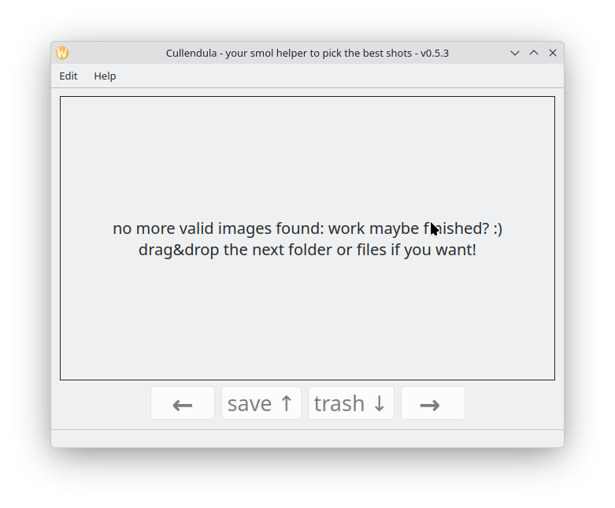

# Cullendula
A program to pick out the best shots of the vast amount of taken pictures per photo session.  
The name itself is a wordplay of the plant `Calendula` and the activity "to cull" (slang for sorting the photos).

## How to use?
Start it and then drag&drop a folder with the pictures or an example picture to the central area of the app. Cullendula figures out itself which path to use.  
It also creates automatically a new folder named "output" inside the given path.  
The first picture of the files is loaded automatically too.  
Cullendula scans the dropped directory for the image file extensions currently enabled in `Main -> Extensions`. The menu offers up to ten common Qt-supported formats such as `jpg`, `jpeg`, `png`, and `webp`, and all entries are enabled by default.  
The widget-based UI also provides `Main -> Style` with `Light` and `Dark` themes. Light mode is the default, and dark mode uses a strong high-contrast palette.  
Switch between the images via the buttons at the botton of the app or use the arrow-keys (LEFT and RIGHT).  
The button "save" (or UP arrow-key) moves the current image to the output-folder.  
The button "trash" (or DOWN arrow-key) moves the current image to the trash-folder.  
When you are done, then close the app. The result (the best photos) are inside the output-folder :)  



## Build
```
cmake -S . -B build
cmake --build build
./build/src/Cullendula
```

## Format the code
This repository ships a `.clang-format` using the default Google C++ style.

Run it from the repository root like this:

```bash
clang-format -i src/*.cpp src/*.h tests/*.cpp tests/*.h
```

## Run the tests after building

The unit tests cover the core CLI and GUI behavior from the command line. They verify:

* `CullendulaUndoStack` push/undo/redo semantics
* `CullendulaFileSystemHandler` path parsing, navigation, file moves, and undo/redo integration
* `CullendulaMainWindow` drag and drop, button flows, menu actions, and basic widget state

You can run them in three supported CLI ways:

```
cmake --build build --target test

cmake --build build --target check

./build/tests/CullendulaTests
```

At the moment the test suite contains one test executable registered with CTest:

* `CullendulaUndoStackTest`

## Compute coverage

Coverage is opt-in and uses `gcov`. The default build is unchanged.

Build, run the tests, and generate the text coverage report:

```
cmake -S . -B build-coverage -DCULLENDULA_ENABLE_COVERAGE=ON
cmake --build build-coverage
cmake --build build-coverage --target coverage
```

This produces:

* `build-coverage/coverage/coverage.txt` as a text summary
* `build-coverage/coverage/gcov/*.gcov` as the detailed per-file gcov output

Because `gcov` also reports inlined code from headers, the coverage output includes relevant Qt and standard-library headers alongside the project source file.

The current coverage target reports on the production code exercised by the existing unit tests. Right now that includes:

* `src/CullendulaUndoStack.cpp`
* `src/CullendulaFileSystemHandler.cpp`
* `src/CullendulaMainWindow.cpp`

## HTML coverage

HTML coverage is only available if one of these standard tools is installed before configuring CMake:

* `gcovr`
* `lcov` together with `genhtml`

Install the tool first, then reconfigure and run:

```
cmake -S . -B build-coverage -DCULLENDULA_ENABLE_COVERAGE=ON
cmake --build build-coverage --target coverage-html
```

If the tool is missing, CMake disables the `coverage-html` target and prints a status message during configure.

This writes:

* `build-coverage/coverage/html/index.html`

### Current state of the coverage report (bad):


## Build information
This is version 0.6.6.

### Builds and runs with:
* Linux, cmake 4.1, GCC 15.2.1, Qt 6.10 (and QtCreator 17)
* not supported nor tested anymore:
  * Windows 7, Qt 5.5 and QtCreator 4.6 (todo: test)  
  * Win 10, Qt 5.15.1 and Qt 6.0 beta with MinGW 8.1 and QtCreator 4.13.2  

## History
* v0.1 was the basic release; working, but ugly
* v0.2 improved useability and stability; more features (move to trash!); refactored code-base; improved code-quality
* v0.3 added tooltips; fixed the "pumping center-label"-issue; added menus; fixed some resizing-issues with the image-label
* v0.4 added undo/redo-functionality with unit-test; added a nice violet icon for the executable and program
* v0.5 moved the buildsystem to cmake (from qmake)
* v0.5.4 fixed the undo-stack unit tests, clarified the CLI test workflow, and corrected the README
* v0.5.6 expanded coverage with deterministic MainWindow tests and documented the HTML coverage workflow
* v0.6.0 ports the project build and test setup to Qt 6.10
* v0.6.1 restores image loading across the Qt-supported readable image formats
* v0.6.2 adds a configurable `Main -> Extensions` menu for choosing which image suffixes are loaded
* v0.6.3 adds a repository-local clang-format configuration based on the default Google C++ style
* v0.6.4 closes the stale-session reload gap with explicit regression coverage when switching to an empty folder
* v0.6.5 strengthens the test suite around extension-filter normalization and the all-filters-disabled UI case
* v0.6.6 adds switchable light and dark widget themes under `Main -> Style`

## Open tasks
* show left and right (if possible) neighbour of the current image as smaller preview ... so that you have some preview of similar pictures follow
* show position and amount: like: "3/234 output: 7 trash: 10" - maybe in the status-bar? - refine this
* add an icon for the program
* make the used image-file-suffixes configureable
* DONE: add some version/help menu-entry
* important: add a file-existance_check before loading to QPixmap
* show the name + path of the current file
* add possibility to open the current file directly
