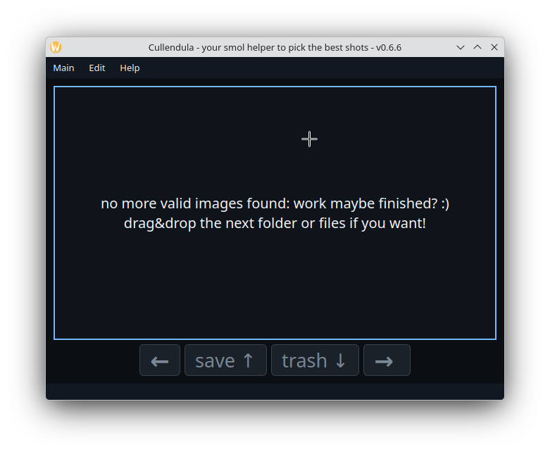
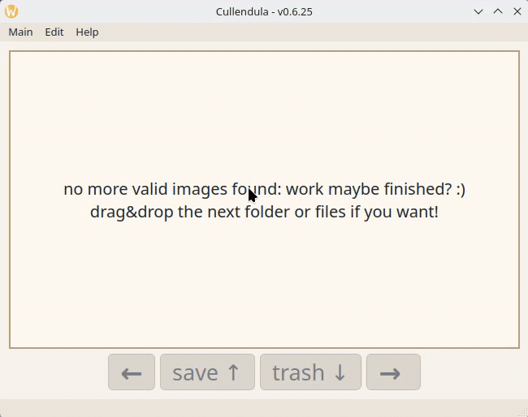
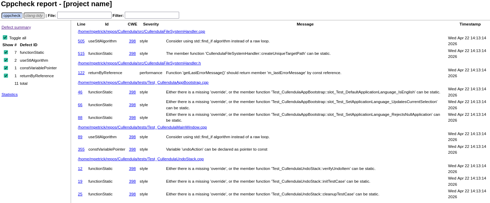
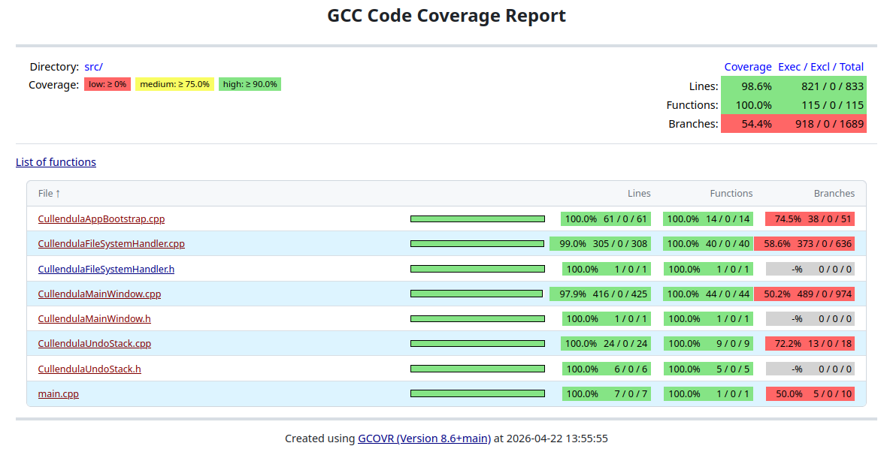

# Cullendula

[](https://github.com/marcelpetrick/Cullendula/actions/workflows/ci.yml)
[](LICENSE)
[](https://www.qt.io/)
[](https://cmake.org/)
[](https://en.cppreference.com/w/cpp/23)

A program to pick out the best shots of the vast amount of taken pictures per photo session.  
The name itself is a wordplay of the plant `Calendula` and the activity `to cull` (slang for filtering photos).

**Author: Marcel Petrick <mail@marcelpetrick.it>**

**Note: projected is generated with AI.**

**License: GPLv3 or later. See `LICENSE`.**

## How to use?
Start it and then drag&drop a folder with the pictures or an example picture to the central area of the app. Cullendula figures out itself which path to use.  
It also creates automatically a new folder named "output" inside the given path.  
The first picture of the files is loaded automatically too.  
Cullendula scans the dropped directory for the image file extensions currently enabled in `Main -> Extensions`. The menu offers up to ten common Qt-supported formats such as `jpg`, `jpeg`, `png`, and `webp`, and all entries are enabled by default.  
The widget-based UI also provides `Main -> Style` with `Light`, `Dark`, and `Purple` themes. Light mode is the default, dark mode keeps the original high-contrast palette, and Purple adds a gloomy violet/cyan variant. The theme is applied application-wide so Qt dialogs follow the selected mode as well.  
Switch between the images via the buttons at the bottom of the app or use the arrow-keys (**LEFT** and **RIGHT**).  
The button "save" (or **UP** arrow-key) moves the current image to the output-folder.  
The button "trash" (or **DOWN** arrow-key) moves the current image to the trash-folder.  
Undo and redo keep the in-memory image list and the visible main view synchronized with the on-disk file moves.  
When you are done, then close the app. The result (the best photos) are inside the output-folder :)  



### Preview of the language- and style-switching


## Build

### tl;dr
Use the `localPipeline.sh` to handle all steps for building, test-runs, coverage generation, documentation, Cppcheck analysis, and a final interactive launch of the built `Cullendula` app.

```sh
time ./localPipeline.sh
[INFO] Project root: /home/mpetrick/repos/Cullendula
[INFO] Build directory: /home/mpetrick/repos/Cullendula/build
[INFO] Coverage build directory: /home/mpetrick/repos/Cullendula/build-coverage
[INFO] Parallel jobs: 20
[INFO] Configuring project in '/home/mpetrick/repos/Cullendula/build'.
[INFO] Building project with 20 parallel job(s).
[INFO] Running unit tests via CTest with 20 parallel job(s).
[INFO] Configuring dedicated coverage build in '/home/mpetrick/repos/Cullendula/build-coverage'.
[INFO] Building coverage configuration with 20 parallel job(s).
[INFO] Generating coverage report.
[INFO] Coverage HTML entry point: /home/mpetrick/repos/Cullendula/build-coverage/coverage/html/index.html
[INFO] Total line coverage: 98.6%
[INFO] Opening coverage report with 'xdg-open'.
[INFO] Generating Doxygen documentation.
[INFO] Doxygen warnings file is empty.
[INFO] Doxygen HTML entry point: /home/mpetrick/repos/Cullendula/build/doxygen/html/index.html
[INFO] Opening generated documentation with 'xdg-open'.
[INFO] Running Cppcheck static analysis.
[INFO] Cppcheck XML report: /home/mpetrick/repos/Cullendula/reports/cppcheck/cppcheck.xml
[INFO] Cppcheck HTML entry point: /home/mpetrick/repos/Cullendula/reports/cppcheck/html/index.html
[INFO] Running clang-format on project C++ sources.
[INFO] clang-format left all tracked source files unchanged.
[INFO] Launching Cullendula as the final pipeline step.
[INFO] Close the application window to let the script finish.

========== Local Pipeline Summary ==========
Configure+Build    : PASS Project configured and built in /home/mpetrick/repos/Cullendula/build
Unit Tests         : PASS CTest completed without failures
Coverage           : PASS Coverage HTML generated successfully in /home/mpetrick/repos/Cullendula/build-coverage
Coverage Gate      : PASS Line coverage is 98.6% (threshold 90.0%)
Open Coverage      : PASS Coverage index.html was handed to the desktop opener
Doxygen            : PASS Documentation generated successfully
Doxygen Warnings   : PASS warnings.txt is empty
Open Docs          : PASS index.html was handed to the desktop opener
Cppcheck           : PASS XML and HTML reports generated in /home/mpetrick/repos/Cullendula/reports/cppcheck
clang-format       : PASS Formatting completed without changing files
Launch App         : PASS Cullendula was started; the script resumed after the window was closed
============================================
./localPipeline.sh  2.05s user 0.67s system 47% cpu 5.718 total
```

----

By default, the documented build commands use all available CPU cores via `--parallel $(nproc)`.
If you want the same behavior without repeating the flag, export `CMAKE_BUILD_PARALLEL_LEVEL=$(nproc)` in your shell first.

```
cmake -S . -B build
cmake --build build --parallel $(nproc)
./build/src/Cullendula
```

### Continuous integration
Every push to `master`, every pull request against `master`, and every manual dispatch runs the same gate on GitHub Actions.
The workflow in `.github/workflows/ci.yml` calls `./localPipeline.sh --noRun`, so CI and the local run cannot drift apart: build, CTest, the 90% line-coverage threshold, an empty Doxygen warning log, Cppcheck and clang-format are all checked by one script.
CI installs the exact pinned dependencies from the table above, and a dedicated step fails the run if the installed CMake or gcovr is not the expected release; a wrong Qt release already fails the CMake configure step.
The runner stays headless via `QT_QPA_PLATFORM=offscreen`, and the generated coverage, Doxygen and Cppcheck reports are attached to every run as the `cullendula-reports` artifact.

### Releases
Pushing a version tag publishes a release:

```bash
git tag v0.7.6
git push origin v0.7.6
```

`.github/workflows/release.yml` refuses to publish unless the tag matches the version in `CMakeLists.txt` and `CHANGELOG.md` has an entry for it, then runs the full pipeline, builds an AppImage, and starts that AppImage headless once to prove the packaged application actually runs.
The release notes are generated from the matching changelog entry.

Each release carries a package for both desktop platforms, plus the generated API documentation:

* **Linux (x86-64):** an **AppImage**. Download it, `chmod +x` it, and run it. It bundles Qt, so nothing has to be installed.
* **Windows 11 (x64):** a **zip**. Unpack it anywhere and run `Cullendula.exe`. The Qt runtime and the MSVC runtime are included, so it needs no installer.

Both packages are started once by the release workflow before anything is published, so a package that cannot start never becomes a release.

The full test suite, the coverage gate and the static analysis run on Linux, which is the supported development platform. The Windows job builds the application and requires the packaged executable to start cleanly; it also runs the unit suite for the record, without gating on it, because parts of that suite still assume POSIX filesystem behaviour.

The AppImage carries the image format plugins whose system libraries exist on the build image. A few of the official Qt plugins link against sonames Ubuntu does not ship, so they are dropped from the package and the corresponding formats simply do not appear in `Main -> Extensions` there; a build from source on your own distribution offers them.

## Format the code
This repository ships a `.clang-format` using the default Google C++ style.

Run it from the repository root like this:

```bash
clang-format -i src/*.cpp src/*.h tests/*.cpp tests/*.h
```

## Generate API docs
If `doxygen` is installed when CMake configures the project, a `doxygen` target is available.

Generate the HTML documentation like this:

```bash
cmake -S . -B build
cmake --build build --target doxygen --parallel $(nproc)
```

The generated HTML entry point is:

* `build/doxygen/html/index.html`
* `build/doxygen/warnings.txt`

The configured Doxygen project version follows the current CMake project version automatically.

## Run Cppcheck

Cppcheck is integrated through the compilation database that CMake now exports automatically as `build/compile_commands.json`.

Run it from the repository root like this:

```bash
cmake -S . -B build
cmake --build build --parallel $(nproc)
./scripts/run_cppcheck.sh --build-dir build
```

This produces:

* `reports/cppcheck/cppcheck.xml`
* `reports/cppcheck/html/index.html` when `cppcheck-htmlreport` is installed

The default Cppcheck run is intentionally conservative:

* it uses `--project=compile_commands.json`
* it enables `warning`, `style`, `performance`, and `portability`
* it uses the bundled Qt library model via `--library=qt`
* it limits analysis to project sources in `src/` and `tests/`
* it keeps findings informational in phase 1 by generating reports without failing purely because findings exist

Tool/setup failures still fail the script and the local pipeline.

## HTML Cppcheck report

The optional HTML report is available when `cppcheck-htmlreport` is installed before running the analysis.

Run the same command as above:

```bash
cmake -S . -B build
cmake --build build --parallel $(nproc)
./scripts/run_cppcheck.sh --build-dir build
```

This writes:

* `reports/cppcheck/html/index.html`

The local pipeline also prints that path and tries to open the generated `index.html` automatically, just like the coverage and Doxygen reports.

### Current state of the Cppcheck report:


## Run the tests after building

The unit tests cover the core CLI and GUI behavior from the command line. They verify:

* `CullendulaUndoStack` push/undo/redo semantics
* `CullendulaFileSystemHandler` path parsing, navigation, file moves, and undo/redo integration
* `CullendulaMainWindow` drag and drop, button flows, menu actions, and basic widget state

You can run them in three supported CLI ways:

```
cmake --build build --target test --parallel $(nproc)

cmake --build build --target check --parallel $(nproc)

./build/tests/CullendulaTests
```

At the moment the test suite contains one test executable registered with CTest:

* `CullendulaUndoStackTest`

## Compute coverage

Coverage is opt-in and uses `gcov`. The default build is unchanged.

Build, run the tests, and generate the text coverage report:

```
cmake -S . -B build-coverage -DCULLENDULA_ENABLE_COVERAGE=ON
cmake --build build-coverage --parallel $(nproc)
cmake --build build-coverage --target coverage --parallel $(nproc)
```

This produces:

* `build-coverage/coverage/coverage.txt` as a text summary
* `build-coverage/coverage/gcov/*.gcov` as the detailed per-file gcov output

Because `gcov` also reports inlined code from headers, the coverage output includes relevant Qt and standard-library headers alongside the project source file.

The current coverage target reports on the production code exercised by the existing unit tests. Right now that includes:

* `src/CullendulaUndoStack.cpp`
* `src/CullendulaFileSystemHandler.cpp`
* `src/CullendulaMainWindow.cpp`

## HTML coverage

HTML coverage is only available if one of these standard tools is installed before configuring CMake:

* `gcovr`
* `lcov` together with `genhtml`

Install the tool first, then reconfigure and run:

```
cmake -S . -B build-coverage -DCULLENDULA_ENABLE_COVERAGE=ON
cmake --build build-coverage --target coverage-html --parallel $(nproc)
```

If the tool is missing, CMake disables the `coverage-html` target and prints a status message during configure.

This writes:

* `build-coverage/coverage/html/index.html`

### Current state of the coverage report:


## Localization
The repository now contains Qt Linguist translation source files in `translations/` for:

* German: `translations/Cullendula_de.ts`
* Croatian: `translations/Cullendula_hr.ts`
* Chinese: `translations/Cullendula_zh_CN.ts`

The CMake build uses Qt 6 `LinguistTools` to turn these `.ts` files into `.qm` files and embeds the generated `.qm` resources into the application. English remains the default language because the source strings are written in English. The runtime language switch is wired through `QTranslator`; the actual translation content can be filled in later without changing the surrounding application structure.

### Translation workflow
User-visible strings from Qt Designer `.ui` files are discovered automatically by Qt `lupdate`.
User-visible strings from C++ sources are discovered when they are marked with Qt translation APIs such as `tr(...)` or a class translation context like `Q_DECLARE_TR_FUNCTIONS(...)`.
Qt also supports translator-facing context:

* in C++ via translator comments written as `//:` immediately before a `tr(...)` call
* in Qt Designer `.ui` files via the `<string comment="...">...</string>` attribute
* for true same-text ambiguities in the same translation context via the optional disambiguation/comment parameter of `tr("Text", "meaning")`

Regenerate the translation source files after adding or changing source strings:

```sh
cmake -S . -B build
cmake --build build --target update_translations
```

This updates the `.ts` files in `translations/`.

After editing the translations, rebuild the application to regenerate the `.qm` files and embed them into the app:

```sh
cmake --build build --parallel $(nproc)
```

In short:

* `update_translations` refreshes the `.ts` files from source code and `.ui` files
* a normal build regenerates the `.qm` files from the current `.ts` files
* the `.ts` update is manual; the `.qm` generation is automatic during builds

## Contributing
The working agreements for this repository live in [`AGENTS.md`](AGENTS.md): the quality gate that has to be green before any commit, the atomic-commit and conventional-commit rules, the rule that every commit bumps the project version, how to bump that version across the four places a unit test checks, how the exact dependency pins are changed, and the code, test, Cppcheck, Doxygen and localization conventions.
They apply to human contributors and to AI agents alike.

## Build information
This is version 0.7.6.

### Expected dependencies
Cullendula pins its toolchain to **exact releases**, not to version floors and not to ranges.
The buildsystem carries the two enforced pins in one place, at the top of `CMakeLists.txt`:

```cmake
set(CULLENDULA_EXPECTED_CMAKE_VERSION "4.4.2")
set(CULLENDULA_EXPECTED_QT_VERSION "6.11.1")
```

| Dependency | Exact expected version | How it is enforced |
| --- | --- | --- |
| CMake | 4.4.2 | `CMakeLists.txt` aborts with a `FATAL_ERROR` on any other version |
| Qt | 6.11.1 | `find_package(Qt6 ... EXACT REQUIRED)`, so a different patch release fails to configure |
| C++ standard | C++23 | `CMAKE_CXX_STANDARD` with `CMAKE_CXX_STANDARD_REQUIRED` |
| gcovr | 8.6 | installed as `gcovr==8.6` in CI |
| GCC | 16.2.1 | verified, not enforced |
| Cppcheck | 2.21.1 | verified, not enforced |
| Doxygen | 1.18.0 | verified, not enforced |
| clang-format | 22.1.8 | verified, not enforced |

The last four are deliberately *not* hard-pinned: they are distribution packages whose exact release differs between a rolling Linux desktop and the CI image, and a `FATAL_ERROR` on them would make the project unbuildable on most machines without improving the produced binary. Their versions are recorded here so a behavioural difference in a report can be traced back to a tool version. The upstream Qt 6.11.2 patch release exists but is not yet packaged for the development machine; the pin moves to it once it is, in its own commit.

Everything above is what CI installs too, so a local pipeline run and a CI run use the same toolchain.

Not supported nor tested anymore:

* Windows 7, Qt 5.5 and QtCreator 4.6
* Win 10, Qt 5.15.1 and Qt 6.0 beta with MinGW 8.1 and QtCreator 4.13.2

## History
The full version history lives in [`CHANGELOG.md`](CHANGELOG.md).

## Open tasks
* show left and right (if possible) neighbour of the current image as smaller preview ... so that you have some preview of similar pictures follow
* show position and amount: like: "3/234 output: 7 trash: 10" - maybe in the status-bar?
* add an icon for the program - started as feature-branch, but problematic for Linux/Wayland
* important: add a file-existance_check before loading to QPixmap
